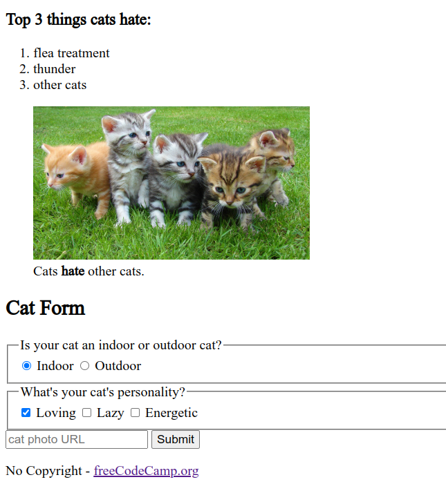

# Cat Photo Gallary

A flawless cat photo Gallary from [freecodecamp.org](https://www.freecodecamp.org/learn/2022/responsive-web-design/#learn-html-by-building-a-cat-photo-app)

---

### Table of Content

<ul>
  <li> <a href="#beware">Beware!</a> - Notice from Yu14 </li>
  <li> <a href="#documentations">Docs</a> - documentation </li>
  <li> <a href="#screenshots">Screenshots</a> - screenshots </li>
</ul>

# BEWARE

Please do not use this material to cheat on your school project or any sort related to education.
it is best if you learn and read resources so u will understand everything.
Think of this as a template and take insp.
There are no laws that suspends you from forking it and using it for your own purposes.

# Documentations

# Screenshots

project sill not done / currently being worked on
